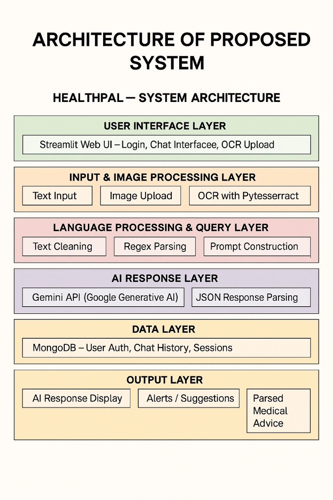

# 🩺 HealthPal – AI Medical & Therapeutic Assistant

## Overview
HealthPal is an AI-powered medical & mental health assistant built with **Streamlit**, **Google Gemini API**, and **MongoDB**.  
It can:
- Answer medical queries
- Provide mental health support
- Analyze medical prescriptions/reports via OCR

## Features
- User authentication
- Chat interface for medical & therapy modes
- OCR-based medical report reading
- AI-powered suggestions & alerts
- MongoDB chat history storage

## Tech Stack
- **Frontend**: Streamlit
- **Backend**: Python
- **Database**: MongoDB
- **AI Model**: Google Gemini 2.5 Flash
- **OCR**: Pytesseract
- **Libraries**: Pillow, pymongo, regex, json

## Architecture


## Installation
```bash
git clone https://github.com/PranavaSonnathi/HealthPal.git
cd HealthPal
pip install -r requirements.txt
streamlit run app.py